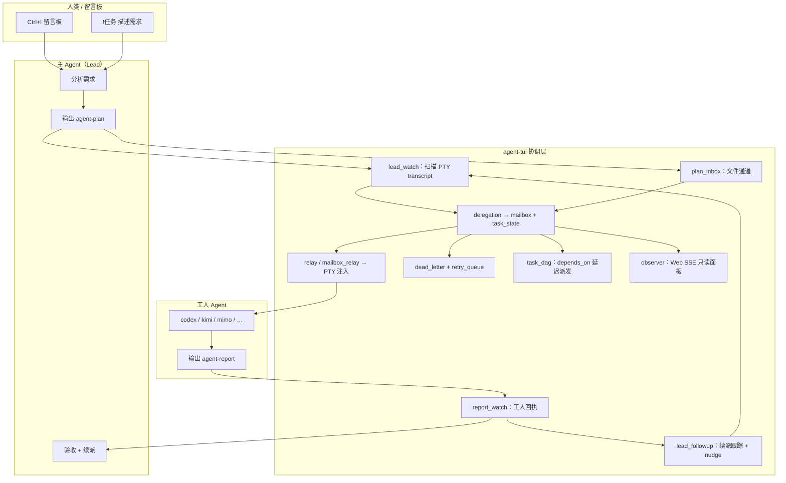

# agent-tui 全流程指南

Windows 原生多 Agent TUI：在 2×2 网格中嵌入最多 8 个 Agent PTY，自动解析 **agent-plan** / **agent-report**，驱动委派、回执、DAG 依赖、死信重试、Lead 续派与 Web 观测。

配合 [agents-complete](https://github.com/zhuguang-ZFG/solid-guacamole)（Git Worktree + `agents.yaml`）使用。

---

## 1. 架构总览



**核心思想**：Agent 仍用各自 CLI 工作；TUI 不替 Agent 思考，只负责 **解析结构化输出、写入共享状态、Relay 注入、状态机与自动化闭环**。

---

## 2. 前置条件

| 依赖 | 用途 |
|------|------|
| Windows 10/11 | ConPTY + 本机 TUI |
| Rust toolchain | `cargo build --release` |
| Git + Worktree | 各 Agent 隔离目录 |
| `.agents/agents.yaml` | Agent 名册与启动命令 |
| 各 Agent CLI | cursor / codex / kimi / mimo 等 |

### 2.1 编译

```powershell
cd agent-tui
$env:CARGO_TARGET_DIR = "$env:TEMP\agent-tui-build"   # 可选：避免 target 占项目盘
cargo build --release
Copy-Item -Force "$env:TEMP\agent-tui-build\release\agent-tui.exe" ".\bin\agent-tui.exe"
```

### 2.2 绑定到项目

在项目 `.agents/local.env` 或环境变量中指定：

```bash
export AGENT_TUI_BIN="D:/path/to/agent-tui/bin/agent-tui.exe"
export AGENT_TUI_PROJECT="D:/your-project"
```

启动（示例，配合 agents-complete CliDeck 方案）：

```powershell
.\.agents\clideckctl.cmd rust
# 或直接
agent-tui --project-dir D:\your-project
```

### 2.3 配置检查

```powershell
agent-tui --check --project-dir D:\your-project
```

---

## 3. 端到端生命周期

### 阶段 A：启动与 Briefing

1. TUI 读取 `agents.yaml`，按序 spawn 各 Agent PTY（ConPTY + vt100）。
2. 为每个 Agent 注入环境变量：`AGENT_TUI=1`、`AGENT_TUI_AGENT`、`AGENT_TUI_LEAD`、`AGENT_TUI_PROJECT`、`AGENT_TUI_COORD_DOC` 等。
3. 主 Agent（Lead，默认 `role: architect`）收到 **协调规则 Briefing**（`lead_watch::maybe_send_briefing`）。
4. 规则同步到 `cursor/worktree/.cursor/rules/agent-tui-orchestrator.mdc`（若存在 cursor worktree）。

### 阶段 B：用户提交任务

| 入口 | 行为 |
|------|------|
| 留言板 `!任务 …` | 写入 inbox + 通知 Lead |
| 人类直接对 Lead 说话 | Lead 在 PTY 内分析 |
| `agent-tui notify cursor "…"` | CLI 定向通知 |

Lead 应拆任务并输出 **agent-plan**（见 §5）。

### 阶段 C：自动派发（双通道）

TUI 每 tick（约 50ms 事件循环 + 5s meta 刷新）扫描：

| 通道 | 模块 | 说明 |
|------|------|------|
| PTY transcript | `lead_watch` | 解析 ` ```agent-plan ` 代码块 |
| 文件队列 | `plan_inbox` | `shared/plan_inbox.jsonl` 追加行 |
| CLI | `plan-submit` | 测试 / 脚本提交 |

解析成功后调用 `delegation::delegate_task`：

- 写入 `shared/mailbox.jsonl`（kind: delegate）
- 更新 `shared/task_state.jsonl`（pending → delegated）
- 写入 `shared/events.jsonl`（Relay 来源）
- 可选认领 `shared/claims.jsonl`
- 更新各 Agent `memory/`（checkpoint、MEMORY、notes）
- 触发 `lead_followup::on_plan_dispatched`（清除续派 pending）

**DAG**：plan 条目含 `depends_on: ["前置-task"]` 时，未满足依赖则进入 `shared/pending_plans.jsonl`，前置 `done` 后由 `task_dag` 自动派发。

### 阶段 D：工人执行

1. **Relay**（`relay` + `mailbox_relay`）把 `[协调/…]` 消息注入工人 PTY。
2. 默认 **Auto Wake**（`AGENT_TUI_AUTO_WAKE=1`）：委派后自动发送 Enter 唤醒 CLI。
3. 工人读私有 inbox：`../../.agents/{name}/memory/inbox.md`。
4. 在各自 **worktree** 内改代码，不跨 Agent 目录。

### 阶段 E：自动回执

工人在终端输出 **agent-report**（见 §5），或由 TUI 扫描 transcript 后：

1. `report_watch` 解析 → `delegation::report_task_auto`
2. 通知 Lead（mailbox + events + Relay）
3. 更新 task_state、memory
4. `lead_followup::on_worker_report` 写入 `shared/lead_followup.jsonl`（pending）

**Report Gate**（可选）：`AGENT_TUI_REPORT_GATE=1` 时，工人报 `done` 前先跑验证命令，失败则改为 `failed`。

### 阶段 F：Lead 续派（Followup）

工人回执 `done` / `failed` / `blocked` 后：

1. **立即重扫** Lead PTY transcript 尾部（默认 12KB，`AGENT_TUI_LEAD_FOLLOWUP_TAIL`）
2. 独立 dedupe 集 `followup_plan_seen`，解析到新 agent-plan → 自动 delegate → 标记 followup satisfied
3. 若 transcript 已含 agent-plan 但未解析出可派发项 → 仍标记 satisfied
4. 超时（默认 120s）→ PTY 注入 **nudge** 催促 Lead 续派（最多 2 次）

Lead 应输出下一波 plan（review / 修复 / 续派），**勿等用户**。

### 阶段 G：失败与重试

`status: failed` 或 `blocked` 时：

1. 写入 `shared/dead_letter.jsonl`
2. 入队 `shared/retry_queue.jsonl`
3. `dead_letter::process_retry_queue` 按策略重委派：
   - 指数退避（`AGENT_TUI_RETRY_BACKOFF=exponential`）
   - 可选轮换工人（`AGENT_TUI_RETRY_ROTATE_WORKER=1`）

### 阶段 H：观测与验收

| 入口 | 功能 |
|------|------|
| TUI `Ctrl+T` | 任务看板 + 记忆 FTS 搜索 |
| TUI `Ctrl+E` | events + mailbox 统一时间线 |
| TUI `Ctrl+I` | 共享留言板 |
| Web | `agent-tui serve` 或 `AGENT_TUI_OBSERVER=1` |
| CLI | `tasks` / `events` / `memory-search` |

### 阶段 I：合并（agents-complete）

多 Agent worktree 改完后，用 agents-complete 的 `merge.sh` / `agentctl merge` 合成一个 PR（超出 agent-tui 范围，见 solid-guacamole 文档）。

---

## 4. 共享状态文件

路径均相对于项目根 `.agents/`：

| 文件 | 用途 |
|------|------|
| `shared/inbox.md` | 公共留言板 |
| `shared/events.jsonl` | 通知事件（Relay 主来源之一） |
| `shared/mailbox.jsonl` | 结构化信箱：user_task / plan / delegate / report |
| `shared/task_state.jsonl` | 任务状态机 |
| `shared/plan_inbox.jsonl` |  durable agent-plan 文件通道 |
| `shared/claims.jsonl` | 任务认领 |
| `shared/pending_plans.jsonl` | DAG 等待依赖的 plan |
| `shared/completed_tasks.jsonl` | 已完成 task id（DAG） |
| `shared/dead_letter.jsonl` | 死信记录 |
| `shared/retry_queue.jsonl` | 待重试队列 |
| `shared/lead_followup.jsonl` | Lead 续派跟踪 |
| `shared/memory_fts.db` | 记忆全文索引（FTS5） |
| `{agent}/memory/MEMORY.md` | 跨会话规则与活跃任务 |
| `{agent}/memory/checkpoint.md` | 最近协调快照 |
| `{agent}/memory/notes.md` | 事件时间线草稿 |
| `{agent}/memory/inbox.md` | 私有 Relay 记录 |
| `agent-tui.log` | TUI 运行日志 |

---

## 5. Agent 协议

### 5.1 agent-plan（Lead 输出）

````markdown
```agent-plan
[
  {"worker":"codex","task":"auth-api","description":"实现登录 API"},
  {"worker":"kimi","task":"login-ui","description":"登录页","depends_on":["auth-api"]},
  {"worker":"mimo","task":"auth-review","description":"审查 auth","depends_on":["auth-api","login-ui"]}
]
```
````

- `task`：字母数字与 `-` `_`，最长 48 字符
- `depends_on`：可选，前置 task 必须 `done` 后才派发
- Lead **不要委派给自己**

**文件通道备份**（推荐与 PTY 双写）：

```json
{"time":"…","lead":"cursor","worker":"codex","task":"auth-api","description":"…","depends_on":[],"source":"cursor"}
```

追加到 `shared/plan_inbox.jsonl`，或：

```powershell
agent-tui plan-submit '[{"worker":"codex","task":"x","description":"y"}]' --project-dir D:\proj
```

### 5.2 agent-report（工人输出）

````markdown
```agent-report
{"task":"auth-api","status":"done","summary":"已实现登录 API 与测试"}
```
````

`status`：`done` | `blocked` | `failed`

**手动回执备用**（留言板或 CLI）：

```
!回执 auth-api 已完成
agent-tui report "已完成" --task auth-api --from codex --project-dir D:\proj
```

### 5.3 看到 `[协调/…]` 前缀

Relay 注入的消息 **必须处理**：

1. 读 `../../.agents/{你的名字}/memory/inbox.md`
2. `【委派·task】` → 立即开工
3. 完成后输出 agent-report

---

## 6. TUI 快捷键

修饰键留给 TUI；普通 `Tab`、数字、`f` 等传给当前 Agent。

| 按键 | 功能 |
|------|------|
| `Ctrl+1`~`Ctrl+8` | 聚焦面板（清除未读） |
| `Ctrl+Tab` / `Ctrl+Shift+Tab` | 上/下一个面板 |
| `Ctrl+I` | 共享留言板 |
| `Ctrl+T` | 任务看板 + 记忆搜索 |
| `Ctrl+E` | 协调事件时间线 |
| `F2` | 全屏 / 退出全屏 |
| `Ctrl+Q` | 退出 |

留言板命令：

| 输入 | 效果 |
|------|------|
| 普通文字 | 广播到 shared/inbox |
| `@codex 请 review` | 定向通知 |
| `!任务 …` | 提交给 Lead |
| `!委派 @codex task 说明` | 手动委派 |
| `!回执 task 说明` | 工人回执 |
| `!认领 task` / `!释放 task` | 认领 / 释放 |

---

## 7. CLI 命令一览

```powershell
# 诊断
agent-tui --check --project-dir D:\proj

# 协调消息
agent-tui notify claude "消息" --from mimo --project-dir D:\proj
agent-tui broadcast "所有人读 inbox" --project-dir D:\proj

# 委派 / 回执
agent-tui delegate codex auth-api --description "实现登录" --project-dir D:\proj
agent-tui report "已完成" --task auth-api --from codex --project-dir D:\proj

# Plan 调试
agent-tui plan-dry-run "@plan.txt" --project-dir D:\proj
agent-tui plan-dry-run "@plan.txt" --execute --project-dir D:\proj
agent-tui plan-submit '[{"worker":"codex","task":"t","description":"d"}]' --project-dir D:\proj

# 观测
agent-tui tasks --project-dir D:\proj
agent-tui events --project-dir D:\proj
agent-tui memory-search "auth" --project-dir D:\proj
agent-tui memory-reindex --project-dir D:\proj

# Web 只读面板（默认 http://127.0.0.1:8787/）
agent-tui serve --project-dir D:\proj --port 8787

# 无 TUI 闭环验证（CI / 开发）
agent-tui verify-loop --project-dir D:\proj
agent-tui verify-live --project-dir D:\proj
```

---

## 8. 环境变量

### 8.1 Agent 运行时（注入 PTY）

| 变量 | 含义 |
|------|------|
| `AGENT_TUI=1` | 在 TUI 内 |
| `AGENT_TUI_AGENT` | 当前 Agent 名 |
| `AGENT_TUI_ROLE` | architect / executor / … |
| `AGENT_TUI_LEAD` | 主 Agent 名 |
| `AGENT_TUI_PROJECT` | 项目根 |
| `AGENT_TUI_COORD_DOC` | COORDINATION.md 绝对路径 |
| `AGENT_TUI_ORCHESTRATOR=1` | 仅 Lead：负责拆任务 |

### 8.2 协调开关

| 变量 | 默认 | 作用 |
|------|------|------|
| `AGENT_TUI_AUTO_DISPATCH` | 1 | 扫描 agent-plan 自动委派 |
| `AGENT_TUI_AUTO_REPORT` | 1 | 扫描 agent-report 自动回执 |
| `AGENT_TUI_AUTO_WAKE` | 1 | 委派后唤醒工人 CLI |
| `AGENT_TUI_RELAY` | 1 | events.jsonl → PTY 注入 |
| `AGENT_TUI_RELAY_COOLDOWN` | 12 | 同 Agent 注入冷却（秒） |
| `AGENT_TUI_PLAN_INBOX` | 1 | 扫描 plan_inbox.jsonl |
| `AGENT_TUI_MAILBOX_RELAY` | 1 | mailbox → PTY |
| `AGENT_TUI_RELAY_SOURCE` | both | events / mailbox / both |
| `AGENT_TUI_PERIODIC_BRIEFING` | 1 | 长会话定期刷新 Lead 规则 |
| `AGENT_TUI_BRIEFING_INTERVAL_SECS` | 7200 | 定时刷新间隔 |
| `AGENT_TUI_BRIEFING_EVERY_REPORTS` | 5 | 每 N 条回执后 re-brief |
| `AGENT_TUI_AUTO_RETRY` | 1 | failed 自动重试 |
| `AGENT_TUI_MAX_RETRIES` | 2 | 单任务最大重试 |
| `AGENT_TUI_RETRY_COOLDOWN_SECS` | 45 | 重试冷却基数 |
| `AGENT_TUI_RETRY_BACKOFF` | exponential | fixed / exponential |
| `AGENT_TUI_RETRY_ROTATE_WORKER` | 1 | 重试轮换工人 |
| `AGENT_TUI_LEAD_FOLLOWUP` | 1 | 回执后续派跟踪 |
| `AGENT_TUI_LEAD_FOLLOWUP_SECS` | 120 | nudge 超时 |
| `AGENT_TUI_LEAD_FOLLOWUP_MAX_NUDGES` | 2 | 最多催促次数 |
| `AGENT_TUI_LEAD_FOLLOWUP_TAIL` | 12000 | transcript 尾部扫描字符数 |
| `AGENT_TUI_REPORT_GATE` | 1 | 回执前跑验证命令 |
| `AGENT_TUI_VERIFY_CMD` | — | 全局门禁命令 |
| `AGENT_TUI_VERIFY_{TASK}` | — | 单任务门禁 |
| `AGENT_TUI_OBSERVER` | 0 | TUI 附带 Web 面板 |
| `AGENT_TUI_OBSERVER_PORT` | 8787 | Web 端口 |
| `AGENT_TUI_OBSERVER_SSE_MS` | 2000 | SSE 推送间隔 |

完整 Agent 侧规则模板见 [`docs/COORDINATION-template.md`](COORDINATION-template.md)，部署到项目 `.agents/COORDINATION.md`。

---

## 9. 源码模块地图

| 模块 | 职责 |
|------|------|
| `app.rs` | 主循环：tick 编排各 watcher |
| `lead_watch.rs` | agent-plan 解析、Briefing、plan_inbox |
| `lead_followup.rs` | 回执后续派、transcript 扫描、nudge |
| `report_watch.rs` | agent-report 解析、自动回传 Lead |
| `delegation.rs` | delegate / report 核心写入 |
| `relay.rs` / `mailbox_relay.rs` | 双通道 PTY 注入 |
| `mailbox.rs` / `task_state.rs` | 结构化状态 |
| `task_dag.rs` | depends_on 依赖闭环 |
| `dead_letter.rs` | 死信与 retry_queue |
| `plan_inbox.rs` | 文件 plan 通道 |
| `agent_memory.rs` | MEMORY / checkpoint / notes |
| `memory_fts.rs` | FTS5 检索 |
| `observer.rs` | Web 面板 + SSE |
| `verify_loop.rs` | 无 TUI 闭环测试 |
| `health.rs` | PTY 健康监测与自动重启 |

---

## 10. 验证与 CI

### verify-loop（推荐）

无 PTY、无 TUI，覆盖：

1. agent-plan / agent-report 解析
2. 委派 → 回执 → memory / events 链
3. failed → dead_letter → retry（含工人轮换）
4. DAG depends_on 延迟派发
5. Lead followup pending → plan 清除
6. Lead transcript tail 扫描 → 自动派发
7. Observer HTTP snapshot + SSE stream

```powershell
agent-tui verify-loop --project-dir D:\proj
```

### verify-live

真实 PTY 注入 + transcript 解析（需本机 Agent CLI）。

---

## 11. Web Observer

```powershell
agent-tui serve --project-dir D:\proj
# 浏览器 http://127.0.0.1:8787/
```

| API | 说明 |
|-----|------|
| `GET /` | 仪表盘 HTML |
| `GET /api/snapshot` | Agents / Tasks / 死信 / 时间线 JSON |
| `GET /api/health` | 健康检查 |
| `GET /api/stream` | SSE 推送（`?once=1` 用于测试） |

TUI 内开启：`AGENT_TUI_OBSERVER=1`。

---

## 12. 典型故障排查

| 现象 | 检查 |
|------|------|
| plan 未自动派发 | `AGENT_TUI_AUTO_DISPATCH`；Lead transcript 是否含合法 JSON；`agent-tui plan-dry-run` |
| 工人未收到委派 | `AGENT_TUI_RELAY`；events.jsonl 是否有新行；Relay 冷却 |
| 回执未到 Lead | `AGENT_TUI_AUTO_REPORT`；agent-report JSON 格式 |
| 续派不触发 | `lead_followup.jsonl` pending；`AGENT_TUI_LEAD_FOLLOWUP` |
| DAG 卡住 | `pending_plans.jsonl`；前置 task 是否 `done` |
| 重试不执行 | `retry_queue.jsonl`；冷却是否到期；`AGENT_TUI_AUTO_RETRY` |
| Web 面板空 | `--project-dir` 是否正确；`.agents` 是否存在 |

日志：`.agents/agent-tui.log`

---

## 13. 与 agents-complete 的关系

```
agents-complete          agent-tui
─────────────────        ─────────────────────────
agents.yaml      ───►    读取 Agent 名册与 worktree
Git Worktree     ◄──►    各 PTY cwd 指向 worktree
shared/inbox     ◄──►    Ctrl+I / Relay 读写
merge.sh         ───►    多 Agent 改动 → 单 PR（TUI 不管合并）
```

推荐 Windows 路径：**Worktree（agents-complete）+ 原生 TUI（agent-tui）+ Web Observer（可选）**。

---

## 14. Lead 身份固化（Cursor）

TUI 启动 / Lead pane 重启时自动：

1. 写入 `.agents/LEAD.md`（Playbook）
2. 同步 worktree `.cursor/rules/agent-tui-orchestrator.mdc`（`alwaysApply: true`）
3. 更新 `AGENTS-agent-tui.md`，并在 `AGENTS.md` 插入 Lead 指针
4. PTY 注入 briefing + 更新 cursor `MEMORY.md` Rules 段
5. 注入环境变量 `AGENT_TUI_ORCHESTRATOR=1`、`AGENT_TUI_LEAD_PLAYBOOK`

实现见 `src/lead_identity.rs`。

---

## 15. 参考链接

- 本仓库 README：[../README.md](../README.md)
- agents-complete / solid-guacamole：https://github.com/zhuguang-ZFG/solid-guacamole
- 项目内协调规则：`.agents/COORDINATION.md`（由 TUI 同步到 Lead worktree 规则文件）
